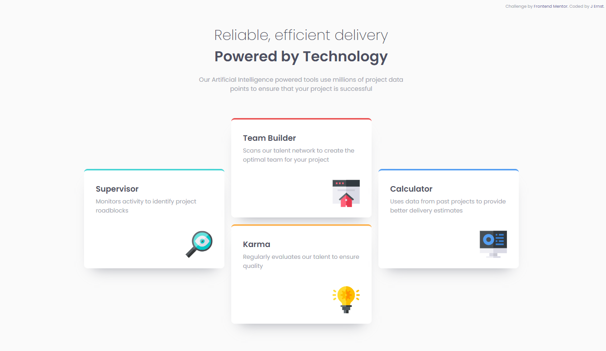

# Frontend Mentor - 3-column preview card component solution

This is a solution to the [3-column preview card component challenge on Frontend Mentor](https://www.frontendmentor.io/challenges/3column-preview-card-component-pH92eAR2-). Frontend Mentor - Challenges to help you improve your coding skills by building realistic projects. 

## Overview

This is another simple info card layout built entirely on HTML and CSS. I decided to try using grid for the desktop layout this time, and had to fiddle with it a lot before I managed to figure out how to set everything up properly, but I think it turned out pretty good in the end! 

### The challenge

Users should be able to:

- View the optimal layout depending on their device's screen size

### Screenshot

### Links

- Solution URL: [https://www.frontendmentor.io/solutions/mobilefirst-layout-using-grid-and-flexbox-XYdW27xMb]
- Live Site URL: [https://nimkamjoon.github.io/Four-card-feature-section/]

### Built with

- HTML5 markup
- CSS custom properties
- Flexbox
- Mobile-first workflow

## Author

Jota Ernst (@nimkamjoon)
